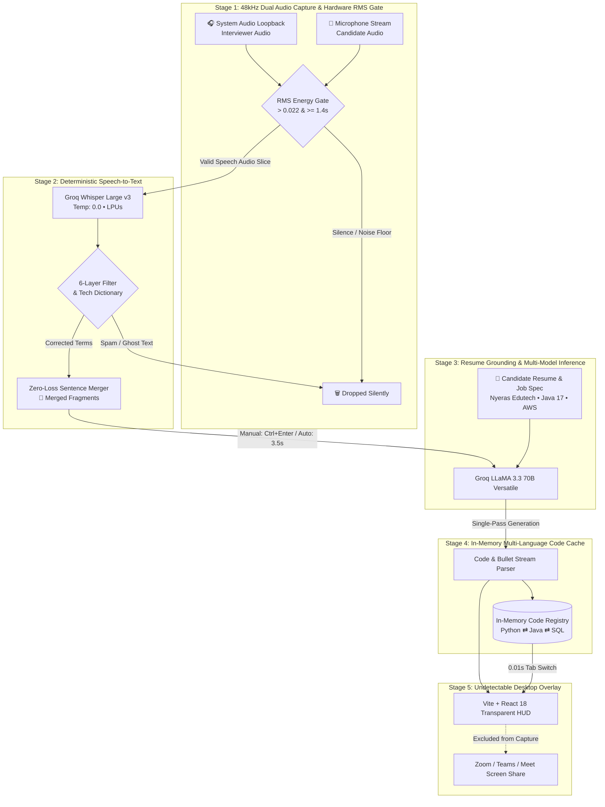

<div align="center">

# ⚡ Interview AI — Real-Time Technical Interview Co-Pilot

### *The #1 Open-Source, Sub-Second, Undetectable AI Assistant for Technical & Behavioral Interviews*

[](https://interview-q9s7ifwmq-mohans-projects-7ac7513d.vercel.app/)
[](https://github.com/mohannamburu18/interview-ai)
[](https://opensource.org/licenses/MIT)
[](https://www.electronjs.org/)
[](https://nextjs.org/)
[](https://www.typescriptlang.org/)
[](https://groq.com/)

<br />

**100% Free Forever • Zero Subscriptions • Hardware RMS Noise Gating • Instant 0.01s Polyglot Code Switching • Invisible to Zoom, Teams & Google Meet**

[🌐 Live Demo Website](https://interview-q9s7ifwmq-mohans-projects-7ac7513d.vercel.app/) • [✨ Features](#-key-features) • [🏗️ Architecture](#-deep-architecture) • [📊 Market Comparison](#-market-comparison) • [🚀 Quick Start](#-quick-start) • [⌨️ Shortcuts](#-keyboard-shortcuts)

</div>

---

## 🌟 Overview

**Interview AI** is an ultra-low-latency, context-grounded AI copilot engineered for software engineers, engineering managers, and technical architects. Running as a transparent, hardware-shielded native desktop HUD, it listens to interviewer questions via system audio loopback, eliminates silence hallucinations, and synthesizes FAANG-grade structured talking points, dual-language code implementations, and conversational verbal scripts.

```
┌────────────────────────────────────────────────────────────────────────────────────────┐
│  🎧 Interviewer (Speaker)                                     🔗 Merged 2 fragments   │
│  "What are the four pillars of OOPS and how do they enforce maintainability?"          │
├────────────────────────────────────────────────────────────────────────────────────────┤
│  ✨ OOPS - 4 CORE PILLARS & ARCHITECTURE                                              │
│                                                                                        │
│  • Encapsulation: Binding data & methods into a single class; private state protection │
│  • Abstraction: Exposing public interfaces while encapsulating implementation details  │
│  • Inheritance: Code reusability via hierarchical class extension (extends)          │
│  • Polymorphism: Dynamic method dispatch via overloading (compile) & overriding (run)  │
│                                                                                        │
│  ┌─ CODE SNIPPET ────────────────────────────────────────────────── [ Copy Code ] ────┤
│  │  < >  [ PYTHON ]  [ JAVA ]  (Instant 0.01s In-Memory Switch)                        │
│  │  class PrimeValidator:                                                             │
│  │      def is_prime(self, n: int) -> bool:                                            │
│  │          return n > 1 and all(n % i != 0 for i in range(2, int(n**0.5) + 1))       │
│  └─────────────────────────────────────────────────────────────────────────────────────┘
│                                                                                        │
│  💬 SAY THIS (Humanized Conversational Script):                                        │
│  "So basically, the four core pillars of Object-Oriented Programming are               │
│   Encapsulation, Abstraction, Inheritance, and Polymorphism. In my project at          │
│   Nyeras Edutech, I used Inheritance and Polymorphism in Java 17 and Spring Boot to    │
│   create reusable base service abstractions and dynamic telemetry handlers..."         │
└────────────────────────────────────────────────────────────────────────────────────────┘
```

---

## ✨ Key Features

### 1. 🛡️ 6-Layer Zero-Hallucination Audio Engine
- **Hardware RMS Noise Floor (`> 0.022 RMS`)**: Ambient room noise, fan hums, and silence are dropped immediately at the audio driver layer.
- **Continuous Speech Duration Gate (`>= 1.4s`)**: Transient noise blips (keyboard typing clicks, mouse taps, coughs) are filtered out.
- **Deterministic Whisper (`temperature: 0.0`)**: Eliminates creative phantom links, promo URLs (`.com`, `www.`), and repetitive keyword loops.
- **Technical Disambiguation Dictionary**: Auto-corrects acoustic misrecognitions silently (*"trust sick"* ➡️ *"TrustSec"*, *"water cloud"* ➡️ *"CRUD in SQL"*, *"four pillars of the"* ➡️ *"four pillars of OOPS"*).

### 2. ⚡ Instant Polyglot Code Switching (0.01s Latency)
- **Dual-Language Pre-Generation**: Generates **both** Python and Java implementations in a single API pass.
- **In-Memory RAM Indexing**: Clicking `[PYTHON]` or `[JAVA]` toggles code in **0.01 seconds** with **zero secondary API calls** and zero loading spinners.
- **Universal Stacks**: Supports Python, Java, TypeScript, Go, Rust, C++, and SQL query generation.

### 3. 💬 Humanized Conversational "SAY THIS" Scripts (90–130 Words)
- **5-Sentence Verbal Structure**:
  1. *Plain definition* ("So basically, [concept] means...")
  2. *Intuitive real-life example* ("For example, when a user signs up...")
  3. *Production experience* ("In my project at Nyeras Edutech, I used Java 17 / Spring Boot to...")
  4. *Measurable impact* ("This reduced MTTD from hours to under 10 minutes...")
  5. *Confident closing takeaway*.

### 4. 🎛️ Dual Candidate Discretion Modes
- **🔒 Manual Mode (<kbd>Ctrl</kbd>+<kbd>Enter</kbd>)**: Accumulates multi-sentence speech continuously without cutting off slow speakers. Answers *only* when triggered.
- **⚡ Auto Mode**: Automatically answers after detecting 3.5 seconds of interviewer silence.
- **Auto-Clearing Question Buffer**: Resets the display cleanly 500ms after generation begins, ready for the next question.

### 5. 👻 100% Undetectable Screen Share Protection
- Electron native OS window shielding (`setContentProtection: true`) excludes the overlay window from video capture encoders in **Zoom**, **Microsoft Teams**, **Google Meet**, **Slack**, and **OBS**.

---

## 🏗️ Deep Architecture



---

## 📊 Market Comparison

| Feature & Capabilities | **Interview AI (Ours)** | **Parakeet AI** | **Final Round AI** | **Cluely AI** |
| :--- | :--- | :--- | :--- | :--- |
| **Pricing & Access** | **100% Free & Open Source** | $49 – $99 / mo | $99 – $149 / mo | $40 – $80 / mo |
| **Zero Hallucination Audio Gate** | **6-Layer RMS + Duration Gate** | Basic VAD | Standard VAD (Ghost Text) | Basic Silence Timer |
| **Instant Code Switching** | **0.01s In-Memory RAM Cache** | 4–5s Delay (API Re-call) | Single Language Output | No Instant Switcher |
| **Polyglot Languages** | **Python, Java, Go, Rust, C++, SQL, TS** | Python / Java Only | Generic Code Blocks | Basic Syntax |
| **Manual Discretion (<kbd>Ctrl</kbd>+<kbd>Enter</kbd>)** | **Yes, Full Candidate Control** | Partial Hotkey Support | Auto-Only Triggering | Auto-Only Triggering |
| **Speech-to-Text Model** | **Groq Whisper Large v3 (48kHz)** | Proprietary Whisper Medium | Standard Whisper v2 | Web Speech API |
| **Humanized Verbal Script** | **90–130 Words (SAY THIS)** | Robotic Textbook Bullets | Long AI Paragraph | Generic Paragraph |
| **Anti-Screen Share Shield** | **Native Window Exclusion** | Browser Window Only | Electron Window Only | Chrome Extension |
| **Data Privacy & BYOK** | **Direct Groq API (Zero Middleman)** | Stored on 3rd-Party Cloud | Session Video Recorded | Stored on Cloud |
| **License & Code** | **MIT Open Source (Self-Hostable)** | Closed Source | Closed Source | Closed Source |

---

## 🚀 Quick Start

### 1. Prerequisites
- **Node.js**: v18.0 or higher
- **Groq API Key**: Free at [console.groq.com/keys](https://console.groq.com/keys) (14,400 requests/day free)

### 2. Clone & Install
```bash
# Clone the repository
git clone https://github.com/mohannamburu18/interview-ai.git
cd interview-ai

# Install monorepo dependencies
npm run install:all
```

### 3. Run the Desktop Application (HUD Overlay)
```bash
# Launch Electron HUD in development mode
npm run electron:dev
```

### 4. Run the Modern Website
```bash
# Launch Next.js 14 landing page
cd website
npm run dev
# Open http://localhost:3000 in your browser
```

---

## ⌨️ Keyboard Shortcuts

| Shortcut | Action | Description |
| :--- | :--- | :--- |
| <kbd>Ctrl</kbd> + <kbd>Enter</kbd> | **Trigger Answer** | Finalizes buffered speech and streams FAANG response immediately |
| <kbd>Ctrl</kbd> + <kbd>\\</kbd> | **Toggle Overlay** | Shows / hides the floating desktop HUD |
| <kbd>Ctrl</kbd> + <kbd>Shift</kbd> + <kbd>C</kbd> | **Copy Answer** | Copies the current SAY THIS script to clipboard |
| <kbd>Ctrl</kbd> + <kbd>Shift</kbd> + <kbd>X</kbd> | **Clear Session** | Purges all transcript buffers and resets HUD state |

---

## 📁 Repository Monorepo Structure

```
interview-ai/
├── website/                    # Next.js 14 Modern Landing Page (Deployed on Vercel)
│   ├── src/
│   │   ├── app/                # App Router (page.tsx, layout.tsx, globals.css)
│   │   └── components/         # Hero, Architecture, Showcase, Comparison, FAQ
│   ├── tailwind.config.ts      # Luxury Light Orange & Purple Theme
│   └── package.json
├── desktop/                    # Native Electron Desktop HUD Overlay
│   ├── src/
│   │   ├── main/               # Electron Main Process (Anti-Screen Share, Shortcuts)
│   │   ├── preload/            # Context Bridge (Audio Capturers, Native APIs)
│   │   └── renderer/src/
│   │       ├── components/     # AIAnswerBox (0.01s Code Switcher), LiveTranscriptionBox
│   │       ├── services/       # dualAudioService.ts (RMS Gate), groqService.ts, promptEngine.ts
│   │       └── store/          # useAppStore.ts (Zustand State & Auto-Clear Buffer)
│   └── package.json
├── vercel.json                 # Vercel Next.js Cloud Deployment Configuration
└── package.json                # Universal Monorepo Scripts
```

---

## 👨‍💻 Author & Credits

Created and maintained with ❤️ by **[Mohan Krishna Namburu](https://github.com/mohannamburu18)**.

- **GitHub**: [@mohannamburu18](https://github.com/mohannamburu18)
- **Repository**: [https://github.com/mohannamburu18/interview-ai](https://github.com/mohannamburu18/interview-ai)
- **Live Website**: [https://interview-q9s7ifwmq-mohans-projects-7ac7513d.vercel.app/](https://interview-q9s7ifwmq-mohans-projects-7ac7513d.vercel.app/)

---

## 📄 License

This project is licensed under the **MIT License** — see the [LICENSE](LICENSE) file for details. 100% Free & Open Source forever.
