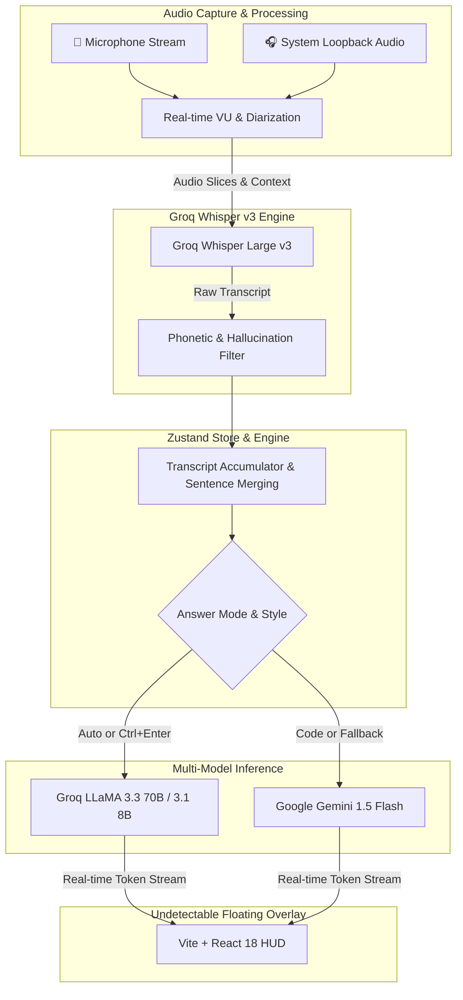

# 🦜 Parakeet AI — Free & Unlimited Interview Co-Pilot

<div align="center">

[](https://opensource.org/licenses/MIT)
[](https://www.electronjs.org/)
[](https://reactjs.org/)
[](https://vitejs.dev/)
[](https://tailwindcss.com/)
[](https://groq.com/)
[](https://aistudio.google.com/)

**The #1 Open-Source, Undetectable, Real-Time AI Interview Assistant**  
*100% Free & Unlimited BYOK (Bring Your Own Key) • Zero Subscriptions • Invisible to Zoom, Teams & Google Meet*

[Features](#-key-features) • [Architecture](#-architecture) • [Quick Start](#-quick-start) • [Shortcuts](#-keyboard-shortcuts) • [Answer Styles](#-answer-styles) • [Security](#-anti-screen-share--privacy)

</div>

---

## ⚡ Key Highlights & Free Architecture

Parakeet AI is designed for software engineers, engineering managers, and technical professionals who need real-time, context-aware co-piloting during live technical and behavioral interviews.

| Component | Provider & Tier | Quota | Cost |
| :--- | :--- | :--- | :--- |
| **Speech-to-Text (STT)** | **Groq Whisper Large v3** | Continuous Streaming | **$0.00 / mo** |
| **Fast Chat & Knowledge Engine** | **Groq LLaMA 3.3 70B & 3.1 8B** | 14,400 Requests / Day | **$0.00 / mo** |
| **DSA & Coding Copilot** | **Google Gemini 1.5 / 2.0 Flash** | 1,500 Requests / Day | **$0.00 / mo** |
| **Anti-Screen Share Shield** | Native `setContentProtection(true)` | Zoom, Teams, Meet, OBS | **$0.00 / mo** |
| **Local Privacy** | AES-256 Encrypted Local Store | 24-Hour Self-Destruct | **$0.00 / mo** |

---

## ✨ Key Features

- 🎧 **Dual-Stream Audio Capture**: Automatically captures both **Interviewer Audio** (System Audio Loopback via desktop capturer) and **Candidate Audio** (Microphone) with independent real-time VU level meters.
- ⏱️ **Slow-Speaker Pause Tolerance**: Intelligently handles slow-speaking interviewers with adaptive 6.5-second merge windows. Sentences are never fragmented mid-thought.
- 🔀 **Dual Answering Modes**:
  - **🔒 Manual Mode (Ctrl+Enter)**: Buffers spoken questions continuously and answers *only* when triggered via global shortcut or on-screen button.
  - **⚡ Auto Mode**: Automatically answers 1.0s after the interviewer concludes speech.
- 🎯 **3-Way Intent & Answer Styles**:
  - **Direct Definition**: Delivers pure, crisp definitions, key SQL/command operations, and query examples without fluff (<70 words).
  - **STAR Story**: Formulates structured *Situation, Task, Action, Result* narratives grounded in your real uploaded resume and metrics (<60 words).
  - **Code Solution**: Streams production-ready TypeScript/Python code with Big-O time and space complexity.
- 🛡️ **Zero Hallucinations & Phonetic Auto-Correction**: Silently corrects acoustic misrecognitions (e.g., *"crude operations in sql"* ➡️ *"CRUD operations in SQL"*, *"doc er"* ➡️ *"Docker"*).
- 👻 **100% Undetectable Screen Share Protection**: Native OS-level hardware window shielding hides the overlay completely from screen sharing software.

---

## 🏗️ Architecture



---

## 📁 Repository Structure

```
├── .env.example                # Free API keys template (GROQ_API_KEY, GEMINI_API_KEY)
├── package.json                # Root monorepo orchestration
├── website/                    # Next.js 14 Landing Page (parakeet-ai.com)
│   ├── src/
│   │   ├── app/                # App Router (page.tsx, layout.tsx, globals.css)
│   │   └── components/         # Hero, Demo Simulator, Platforms, Features, Pricing
│   └── package.json
└── desktop/                    # Native Electron Desktop Overlay App
    ├── src/
    │   ├── main/               # Electron Main (Anti-screen share, shortcuts, store)
    │   ├── preload/            # Context Bridge (window.parakeetAPI)
    │   └── renderer/           # Overlay UI, Audio Engine, Groq & Gemini SDKs
    │       ├── src/
    │       │   ├── components/ # OverlayHeader, LiveTranscriptionBox, AIAnswerBox, Modals
    │       │   ├── services/   # dualAudioService.ts, groqService.ts, promptEngine.ts
    │       │   └── store/      # useAppStore.ts (Zustand state & merging logic)
    └── package.json
```

---

## 🚀 Quick Start

### 1. Prerequisites
- **Node.js**: v18.0.0 or higher
- **npm** or **yarn**

### 2. Installation
```bash
# Clone the repository
git clone https://github.com/your-username/parakeet-ai.git
cd parakeet-ai

# Install root, web, and desktop dependencies
npm run install:all
```

### 3. Get Free API Keys (30 Seconds)
1. **Groq API Key** (Free 14,400 req/day): [https://console.groq.com/keys](https://console.groq.com/keys)
2. **Google Gemini Key** (Free 1,500 req/day): [https://aistudio.google.com/app/apikey](https://aistudio.google.com/app/apikey)

Add your keys directly into the app's **Settings Modal** on startup or create a `.env` file:
```env
GROQ_API_KEY=gsk_your_groq_key_here
GEMINI_API_KEY=AIzaSy_your_gemini_key_here
```

### 4. Run Desktop Overlay App
```bash
npm run electron:dev
```

### 5. Run Landing Page (Optional)
```bash
npm run dev:web
```
Open [http://localhost:3000](http://localhost:3000) to view the marketing landing page.

---

## ⌨️ Keyboard Shortcuts

All shortcuts are registered globally and work even when Zoom, Google Meet, Microsoft Teams, or VS Code is focused:

| Shortcut | Action | Description |
| :--- | :--- | :--- |
| <kbd>Ctrl</kbd> + <kbd>Enter</kbd> | **Trigger Manual Answer** | Generates an AI answer for the last buffered question |
| <kbd>Ctrl</kbd> + <kbd>Space</kbd> | **Toggle Listening / Pause** | Instantly pauses or resumes audio recording |
| <kbd>Ctrl</kbd> + <kbd>Shift</kbd> + <kbd>C</kbd> | **Toggle Code Mode** | Switches to Gemini 1.5 Flash for LeetCode / DSA questions |
| <kbd>Ctrl</kbd> + <kbd>Shift</kbd> + <kbd>H</kbd> | **Panic Hide / Show** | Instantly hides the overlay from your screen |

---

## 🎯 Answer Styles

Use the dropdown in the bottom control bar to tailor responses:

- **Auto Detect (Default)**: Dynamically chooses between direct definitions and behavioral STAR stories based on the question's phrasing.
- **Direct Definition**: Textbook-style concise explanations with exact command keywords and query examples (<70 words).
- **STAR Story**: High-impact behavioral answer formatted in *Situation, Task, Action, Result* grounded in your uploaded resume (<60 words).
- **Code Solution**: Optimal code implementation with Big-O Time & Space analysis.

---

## 🔒 Anti-Screen Share & Privacy

1. **Hardware-Level Invisibility**:
   Electron's `BrowserWindow.setContentProtection(true)` prevents screen capture APIs (Zoom, MS Teams, Google Meet, OBS, Discord) from capturing the window. The interviewer only sees your desktop background or the window behind Parakeet.
2. **Zero Cloud Storage**:
   Your resume, job descriptions, and API keys are stored locally on your machine with AES-256 encryption.
3. **Automatic 24-Hour Self-Destruct**:
   All session history and transcripts are purged automatically after 24 hours.

---

## 📦 Building Standalone Release Installers

To package ready-to-install binaries using `electron-builder`:

```bash
# Windows (.exe installer + portable executable)
npm run package:win

# macOS (.dmg Apple Silicon & Intel)
npm run package:mac

# Linux (.AppImage & .deb)
npm run package:linux
```
Installers will be generated in `desktop/release/`.

---

## 📄 License

This project is licensed under the [MIT License](LICENSE).
